<p align="center">
  
</p>

<p align="center">
  <a href="https://github.com/anivarhq/chameleon-ip/releases/latest"></a>
  <a href="LICENSE"></a>
</p>

Chameleon IP turns a phone, tablet, Mac or PC into a camera. Turn it on and the live picture is
right there on the device. When you want to record it, or watch it from somewhere else, it
speaks standard RTSP and ONVIF, so [Anivar](https://github.com/anivarhq/anivar), Frigate,
Blue Iris, VLC or any recorder can add it, and most will find it on the network by themselves.

## Download

These links always fetch the newest version. It's an early release, and each platform says how
far it has been tested.

| Platform | Download | Tested |
|---|---|---|
| **Windows** 10 / 11, x64 | [**App** `.zip`](https://github.com/anivarhq/chameleon-ip/releases/latest/download/ChameleonIP-windows-x64.zip) | Engine and live picture on a Windows 11 laptop's webcam; the window by its automated tests |
| **Android** 7+ | [**APK**](https://github.com/anivarhq/chameleon-ip/releases/latest/download/ChameleonIP-android.apk) | On an Android 14 emulator, every change: installs, shows the picture, and the stream plays as H.264 1280×720 with its password. Not yet on a phone |
| **macOS**, Apple Silicon and Intel | [**App** `.zip`](https://github.com/anivarhq/chameleon-ip/releases/latest/download/ChameleonIP-macos.zip) | Built every change; not yet run on a Mac |
| **Linux** x64 | [**App** `.tar.gz`](https://github.com/anivarhq/chameleon-ip/releases/latest/download/ChameleonIP-linux-x64.tar.gz) | Built every change; not yet run on a Linux desktop |
| **iPhone, iPad** | Build from source ([CONTRIBUTING.md](CONTRIBUTING.md)) | Builds every change; a download needs an Apple developer account |
| **Headless engine**, no window | [Windows](https://github.com/anivarhq/chameleon-ip/releases/latest/download/chameleon-windows-amd64.exe) · [macOS](https://github.com/anivarhq/chameleon-ip/releases/latest/download/chameleon-darwin-arm64) · [Linux](https://github.com/anivarhq/chameleon-ip/releases/latest/download/chameleon-linux-amd64) · [all](https://github.com/anivarhq/chameleon-ip/releases/latest) | For servers and scripts |

Tried it on a device we haven't? [Tell us how it went](https://github.com/anivarhq/chameleon-ip/issues/new).

### Before you open it

- **The desktop apps need ffmpeg**, installed once: `winget install Gyan.FFmpeg` on Windows,
  `brew install ffmpeg` on a Mac, `sudo apt install ffmpeg` on Linux. It's the one piece we
  don't ship, because its licence would change this app's. If it's missing, the app tells you.
- **Nothing is code-signed yet.** Windows says *"Windows protected your PC"*: click **More info →
  Run anyway**. On a Mac, try to open it once, then **System Settings → Privacy & Security →
  Open Anyway**. On Android, allow your browser or files app to install the APK.

## Using it

1. **Turn on the camera.** The picture shows on the screen, with a *Live* badge. On a phone, stand it on
   its side: the app runs in landscape, like the stream.
2. **That's all you need to see it.** The device doesn't have to be added anywhere.
3. **To record it or watch it elsewhere, press *Use with a recorder*.** You get the address, and a
   QR code on desktop, to add in Anivar, Frigate, Blue Iris, VLC or any app that takes RTSP or
   ONVIF cameras. Many recorders on the same network find it without being told.

## What a device serves

- **RTSP on port 8554.** H.264, 1280×720 at 15 fps, about 2 Mbps, a keyframe every 2 s. Digest
  authentication.
- **ONVIF on port 8000**, plus discovery, so recorders find it and read its real resolution and
  frame rate.
- **A username and password generated on the device.** Nothing is served without them. They live
  in the Android keystore, the Apple keychain, or a DPAPI-sealed file on Windows.
- **Your network only.** Connections are refused before any protocol runs unless they come from a
  private address, link-local, or a Tailscale one. A phone usually holds a globally routable IPv6
  address, so without that rule the camera would answer the internet.
- **Password guessing is slowed per address**, and never by locking the account, since locking one
  is how a camera locks out its own recorder. An address that signed in within the last day is
  never blocked.

It gives each new viewer a keyframe straight away, and stamps frames with the time they were
captured, so recordings don't drift.

## Known limits

- **iOS needs Apple's multicast entitlement** before recorders can discover it automatically;
  until then, add it by address. The app also has to stay open, since iOS stops the camera the
  moment it leaves the screen, so it offers a near-black *Guard* screen.
- **Windows already runs its own discovery service** on the same port, so a Windows desktop camera
  answers direct probes but not broadcast ones. Anivar sends direct probes; other recorders may
  need the address typed.
- **Android runs in landscape.** The stream follows the camera sensor, so the app does too, and what
  you see is what recorders get. On the few phones whose camera is mounted the other way round, the
  stream arrives upside down; [tell us](https://github.com/anivarhq/chameleon-ip/issues/new) if yours
  does.
- **Android can't restart itself after a reboot** (Android 15 and later). Tap the notification to
  resume.
- **A webcam's own limits apply.** Frame rate depends on what the camera offers at 1280×720, and
  many built-in cameras slow down in low light.
- **No audio yet**, though the core is ready for it.

## How it is built

```
                      core/  (Go, shared by everything)
        RTSP server · ONVIF service · WS-Discovery · Digest auth
         ▲                     ▲                      ▲
   Android (Kotlin)      Apple (Swift)          Desktop (Go)
   Camera2 → MediaCodec  AVCapture → VideoToolbox  ffmpeg → NVENC/QSV/AMF
                                                   with a Flutter window
```

Capture and encoding are native on each platform, because the camera has to write straight into
the hardware encoder and no cross-platform framework exposes that. Everything after the encoder
(the protocols, where the bugs live) is one Go package that every platform links. The research
behind that choice is in [docs/research.md](docs/research.md).

## Verify your download

Every file on the release has a `.sha256` beside it. Download both, then:

```powershell
# Windows: prints True if the file is exactly the one we published
$want = (Get-Content .\ChameleonIP-windows-x64.zip.sha256).Split()[0]
(Get-FileHash .\ChameleonIP-windows-x64.zip -Algorithm SHA256).Hash -eq $want
```

```bash
shasum -a 256 -c ChameleonIP-macos.zip.sha256      # macOS
sha256sum -c ChameleonIP-android.apk.sha256        # Linux, or any file
```

## Contributing and security

[CONTRIBUTING.md](CONTRIBUTING.md) covers building each platform; testing on real devices helps
most right now. Security reports go privately through [SECURITY.md](SECURITY.md).

## License

[Apache-2.0](LICENSE). ffmpeg, which the desktop apps use, is installed separately and keeps its
own licence.
